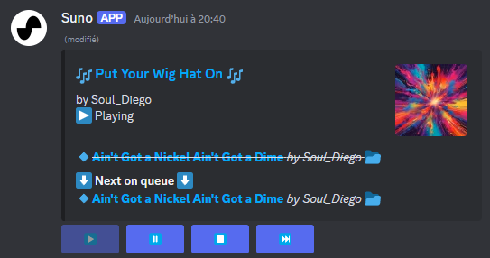
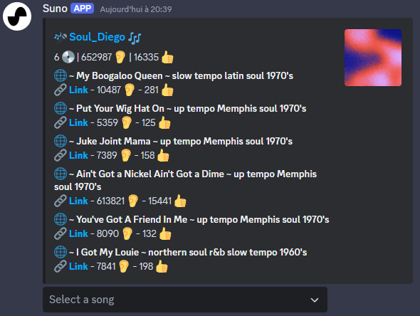
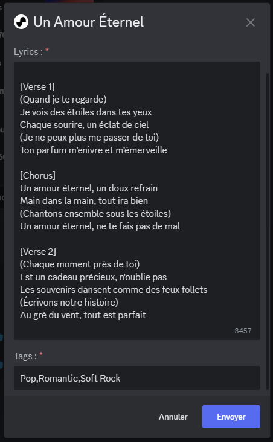

# SUNO Discord Bot

## Description

SUNO Discord Bot is a versatile music bot designed to play SUNO music directly in your Discord server. Simply provide a SUNO URL, and the bot will play the music for you. The bot also allows you to manage the music queue with commands to add, remove, skip, pause, resume, and stop music. Additionally, you can search and save local SUNO music. **It can also generate lyrics and song if you provide a `OPENAI_API_KEY`**

## Features

### An Embed Player to contol the playlist.

### A Profile Search to get all the music made by a specific profile.

### A Generation modal to create your own music inside Discord, and directly queue it.

## Commands

| Command      | Description                   | Options                                                                                          |
|--------------|-------------------------------|--------------------------------------------------------------------------------------------------|
| `profile`    | Search a SUNO profile by handle     | - `suno_profile`: (Required) Searched profile, with autocomplete based on local profiles already saved. *UNUSED IF `SHOULD_SAVE_LOCALY` IS FALSE*                                                              |
| `play`       | Play a SUNO music             | - `suno_url`: (Required) a SUNO URL                                                                     |
| `skip`       | Skip a sound                  | None                                                                                             |
| `pause`      | Pause sound                   | None                                                                                             |
| `resume`     | Resume sound                  | None                                                                                             |
| `stop`       | Stop sound                    | None                                                                                             |
| `generate`       | *Not registered if no `OPENAI_API_KEY`* Generate Lyrics based on your prompt, once reviewed will generate the song and queue it                   | - `suno_prompt`: (Required) A song prompt                                                                                               |

## Setup

To configure the SUNO Discord Bot, you need to set the following environment variables:

- **Required:**
  - `LOCALE`: The [ISO 639 language](https://en.wikipedia.org/wiki/List_of_ISO_639_language_codes#:~:text=ISO%20639%20is%20a%20standardized,(sets%202%E2%80%935).) code of bot default language.
  - `DISCORD_ID`: Your Discord bot ID.
  - `DISCORD_TOKEN`: Your Discord bot token.
  - `SUNO_COOKIE_[value]`[^1]: A Suno Cookie [Check here to see how to retrieve it](https://github.com/gcui-art/suno-api). 
  > [!TIP]
  > You can add multiple, juste replace the `[value]`, one of them will be picked to call the api or generate songs.
  > If you got an issue because of the length of the cookie, you can use it in ./config/.env

- **Optional:**
  - `OPENAI_API_KEY`: API key from Open AI, required if you want the bot to generate lyrics and songs.
  - `OPENAI_PROMPT`: Prompt to generate the lyrics, use `${lang}` as a variable to add the selected language from `OPENAI_API_KEY`.
  - `SHOULD_SAVE_LOCALY`: Defines if SUNO musics should be saved localy or only remain on the web.
  - `SAVED_DATA_PATH`: Defines the path where all suno data will be stored on the server. Default is `./suno`. *UNUSED IF `SHOULD_SAVE_LOCALY` IS `False`*
  - `LOG_LEVEL`: Defines the logging level of the Bot. Default is `warning`.

A Docker image is also available via [Docker Hub](https://hub.docker.com/r/pekno/sunobot).

With these configurations, you can start your SUNO Discord Bot and enjoy seamless music playback in your Discord server.

## Thanks

Thanks to the contributors of the [Suno-API](https://github.com/gcui-art/suno-api) Project, most of the Backend API was based on their work.

## Ideas / To do

- [ ] Add the ability to generate song without OpenAI
- [ ] Add the ability to play whole playlist
- [ ] Add check for OpenAi credit before trying generation
- [ ] Fix case when player message was deleted
- [ ] Optimize Suno API calls

[^1]: For example you can add a number `SUNO_COOKIE_42` or even use text `SUNO_COOKIE_TEST`